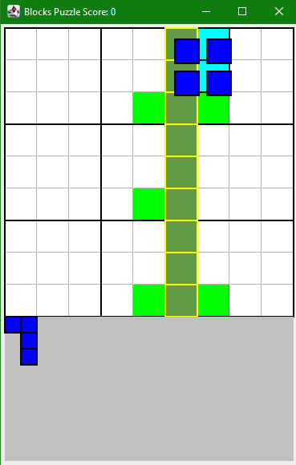
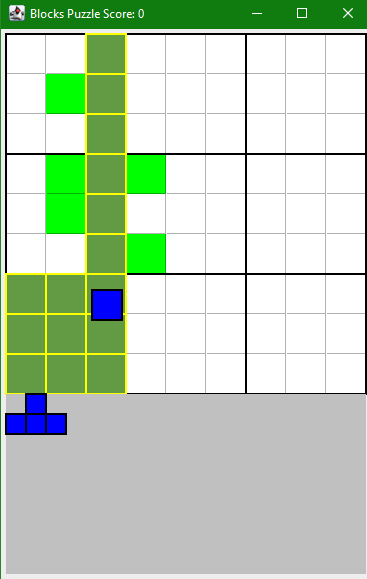

# Blockodoku

## How to play
The game is about completing a row, column or a 3x3 grid of cells to earn points. You can click on a piece visible at the bottom and drag it anywhere on the grid. It will then show a ghost piece behind it showing where it will be placed.

You have a selection of shapes that you can place which is refilled only when the palette is empty. This is what the board looks like after a shape has been placed.

When the you complete a row, column, or 3x3, that space will be highlighted in green and yellow to show that it will be removed and that it will increment the score.

You can then continue to play until it is game over and aim for the highest score. A game over is when the player can no longer place any of the shapes in their palette on the board. This is what a game over state of the game looks like.

The score will increase more for each subsequent completion that you get. Typically each completion gives you 10 points, however in the image below you can see that if i complete 2 at the same time or two in a row, my score is increased by 30 instead  (10*1 + 10*2 = 30)

Lastly, I have added the automatic random play, which places random pieces in random locations which is great for testing! You need to drag the bottom of the window down to reveal it!

##How to start

Download the code and run the Controller class located within the blocks Folder. This project is made with Java, so you must have Java installed and a way to run Java code.
