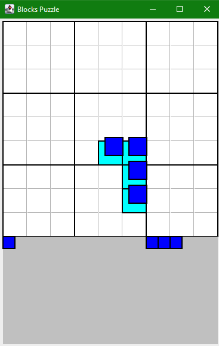

# 🧩 Blockodoku

Blockodoku is a grid-based puzzle game inspired by Sudoku and block placement mechanics. The objective is to strategically place pieces on a board to complete rows, columns, or 3×3 sections and earn points. Simple to learn, challenging to master!
## 🎮 How to Play

The core gameplay revolves around placing randomly generated shapes onto a grid. You earn points by completing:

1.    Full rows

2.    Full columns

3.    Full 3×3 squares

## 🧱 Piece Placement

Click and drag one of the shapes from the bottom of the screen onto the grid. A ghost piece will appear to show where it will land before releasing.

Once placed, the board updates to reflect the new layout.

## ✅ Completing Rows, Columns, or 3×3 Squares

When a valid section is completed, it will be highlighted in green and yellow to show it's being cleared — and your score will increase accordingly.

## 🧠 Score System & Combos

Each completed section earns 10 points. Multiple completions at once (or in sequence) result in combo bonuses. For example, completing two at once gives 30 points (10 for the first, 20 for the second).

## ☠️ Game Over

The game ends when none of the current shapes in the palette can be placed on the board.

## 🤖 Automatic Random Play (For Testing)

An automatic "random play" mode is included for testing purposes — it randomly places pieces on the board. To access this, drag the bottom of the window downward to reveal the controls.
## 🚀 How to Start

1.    Download or clone this repository

2.    Navigate to the blocks folder

3.    Run the Controller class to launch the game

    Note: This project is built in Java, so you must have Java installed and a compatible IDE or terminal to run Java code.
